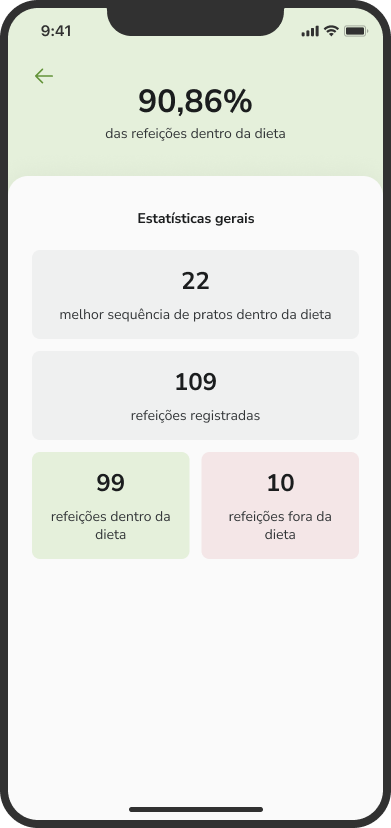
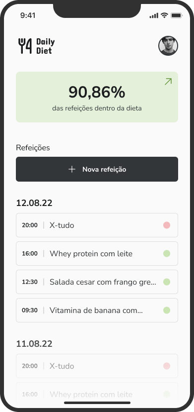
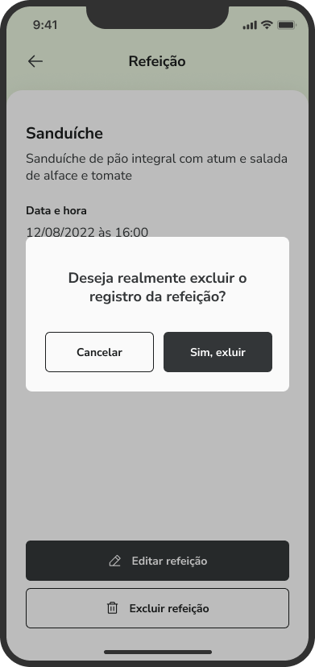

# Daily Diet


> Esse e um aplicativo de controle de dietas onde o usuário informa diariamente o que consumiu nas refeições para acompanhar um progresso de dieta. Trata-se de um desafio do curso de React native da [Rocketseat](http://app.ropcketseat.com.br)

<div
  style="width:100%; display:flex; align-items:center; gap:16px" 
>





</div>

## Detalhes do aplicativo

- A idéia central do aplicativo é o usuário informar diariamente todas as suas refeições e assim gerar uma análise sobre o comprometimento com a dieta.
- Nele é possivel cadastrar uma refeição, visualizar, editar e remover. Alem de consultar estatísticas sobre o número de refeições cadastradas e o percentual de refeições saudáveis.

## 🚀 Melhorias implementadas
- [x] - Dados salvos no Storage do dispositivo
- [x] - Estilização com styled components
- [x] - Biblioteca de icones phosphor icons
- [x] - Alertas a cada interação


## 💻 Como usar o projeto
Para gerar uma cópia do projeto e implementar as suas melhorias, esteja em um computador com Node Js instalado e siga as etapas abaixo:

1  clone o projeto com o comando 
```
git clone https://github.com/maykonsousa/dailyDiet
``` 
2  Acesse o projeto pelo terminal com o comando 
```
cd dailyDiet
```  
3  Instale as dependências necessárias com o comando
```
npm install
```

4  Rode o projeto com o comando
```
npm run android
``` 
5  Acesse o aplicativo em seu dispositívo físico com o app Expo Go ou pelo Android Studio 

## 🌐 Links úteis
[NodeJS](https://nodejs.org/en/download)  
[Expo](https://expo.dev/)  
[Android Studio](https://developer.android.com/studio/install?hl=pt-br)  
[Figma do projeto](https://www.figma.com/file/9oFvFCof9KMaxDsH9IhPjg/ToDo-List-%E2%80%A2-Mobile)


## 🧑‍💻 Maykon Sousa

[](https://www.linkedin.com/in/maykonsousa)
[](https://gthub.com/maykonsousapb)
[](http://wa.me/5561992943297)
[](http://maykonsousa.dev.br
)